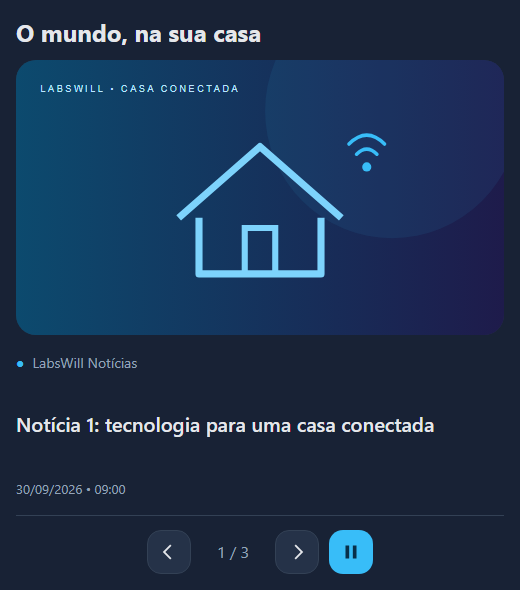

# RSS LabsWill HA

[](https://github.com/Willyanlz/rss-labswill-ha/releases)
[](https://www.hacs.xyz/docs/faq/custom_repositories/)
[](https://github.com/Willyanlz/rss-labswill-ha/actions/workflows/release.yml)
[](https://github.com/Willyanlz/rss-labswill-ha/actions/workflows/hacs.yml)
[](LICENSE)

**Notícias no seu painel. Leitura no seu ritmo.**

Carrossel RSS para Home Assistant, pensado para tablets e painéis de automação:
controles confortáveis ao toque, notícias alternadas entre fontes, leitor integrado
e QR Code para continuar no celular.

Esta é uma personalização do **[RSS News Card for Home Assistant](https://github.com/suxlala/rss-news-card)**,
criado por **[suxlala](https://github.com/suxlala)**. Os créditos pelo projeto original
são de seu autor; a LabsWill mantém as adaptações do carrossel, controles e leitor.



[](https://my.home-assistant.io/redirect/hacs_repository/?owner=Willyanlz&repository=rss-labswill-ha&category=plugin)

 · [Versões](https://github.com/Willyanlz/rss-labswill-ha/releases)
 · [Changelog](CHANGELOG.md)
 · [Reportar problema](https://github.com/Willyanlz/rss-labswill-ha/issues)

## Instalação

Requer Home Assistant com HACS e navegador atualizado. Este repositório é um
**Dashboard / Lovelace card**, não um add-on nem uma integração de sensores.

1. No HACS, abra o menu **⋮ → Repositórios personalizados**.
2. Informe `https://github.com/Willyanlz/rss-labswill-ha` e selecione **Dashboard**
   (em versões antigas, **Lovelace / Plugin**).
3. Localize **RSS LabsWill HA**, baixe a versão e recarregue o painel.
4. Confira em **Configurações → Painéis → Recursos** (modo avançado):
   `/hacsfiles/rss-labswill-ha/rss-labswill-ha.js`, tipo **Módulo JavaScript**.
   Se o HACS já criou o recurso, não o duplique.
5. Configure os sensores abaixo e adicione um cartão manual usando o exemplo.

### Migrando a personalização antiga

O tipo continua sendo `custom:rss-news-card`, preservando o YAML dos dashboards.
Remova o recurso antigo `/local/community/rss-news-card/rss-news-card.js` (ou
equivalente `/hacsfiles/rss-news-card/...`) da lista de recursos e mantenha somente
o novo. Se o card original estiver instalado pelo HACS, remova-o também: os dois
registram o mesmo componente. Guarde uma cópia do antigo antes de migrar.
Recarregue completamente os navegadores dos painéis após a troca.

### Criar o sensor no configuration.yaml

O HACS instala o card. Para buscar as notícias, configure o leitor e um sensor:

1. Copie [fetch-rss.py](scripts/fetch-rss.py) para `/config/scripts/fetch-rss.py`.
2. Cadastre seus feeds em `FEEDS` no script (há instruções PT-BR/EN) ou crie
   `/config/rss-feeds.json`. O script vem sem fontes predefinidas. Exemplo:

```json
{
  "g1_araraquara": "https://g1.globo.com/rss/g1/sp/sao-carlos-regiao/"
}
```

3. Adicione ao `/config/configuration.yaml`:

```yaml
command_line:
  - sensor:
      name: Notícias G1 Araraquara e região
      unique_id: noticias_g1_sao_carlos
      icon: mdi:rss
      scan_interval: 600
      command: "python3 /config/scripts/fetch-rss.py g1_araraquara"
      command_timeout: 60
      value_template: "{{ value_json.articles | count }} artigos"
      json_attributes:
        - articles
```

Se já existe `command_line:`, adicione apenas o bloco `- sensor:` dentro dele,
mantendo a indentação. Para outra fonte, troque o nome, `unique_id` e o identificador
no fim do comando; esse identificador deve existir em `FEEDS` ou no JSON.

4. Verifique a configuração e reinicie o Home Assistant.
5. Em **Ferramentas de desenvolvedor → Estados**, procure o sensor e confirme
   que existe o atributo `articles`. Copie o `entity_id` real para o card abaixo:
   `unique_id` não define o `entity_id`, que pode variar se já houver uma entidade.

O sensor consulta a fonte a cada 600 segundos. Se o portal demorar e ocorrer timeout,
aumente `command_timeout` para 90. O leitor suporta RSS XML, com até 20 itens por fonte.
[Documentação do sensor command_line](https://www.home-assistant.io/integrations/command_line/).

> [!TIP]
> Se nenhuma notícia aparecer, confira o atributo `articles` do sensor e o `entity_id` usado no card.
> O identificador no comando Python também precisa corresponder à chave cadastrada em `FEEDS` ou `rss-feeds.json`.

## Seu primeiro card

```yaml
type: custom:rss-news-card
title: Notícias
autoplay: true
slide_interval: 8
interaction_timeout: 20
pause_timeout: 60
max_articles: 20
show_description: false
show_source: true
show_date: true
image_fit: contain
sources:
  - entity: sensor.noticias_g1_araraquara_e_regiao
    name: G1 Araraquara e região
```

O card ordena as notícias dentro de cada fonte, alterna as fontes e remove links
repetidos. Se uma fonte tiver poucos itens, as outras preenchem as vagas.

## Reprodução e interação

| Ação | Comportamento |
| --- | --- |
| Sem interação | Avança a cada `slide_interval` segundos e volta ao primeiro item no fim. |
| Mouse sobre o card, mesmo parado, ou foco por teclado/mouse | Pausa enquanto estiver sobre o card ou com foco nele. Após retirar o mouse e o foco, aguarda `interaction_timeout` e retoma. |
| Toque e swipe | Aguarda `interaction_timeout` sem interação e retoma; o foco deixado pelo toque não mantém o tablet pausado. |
| Pausa | Retoma após `pause_timeout` sem interação, seguido de um intervalo completo de leitura. |
| Play | Retoma com um intervalo completo antes da próxima notícia. |
| Matéria aberta | Suspende a troca até fechar o leitor; depois aplica a espera de interação. |
| Card fora da tela, aba oculta ou dashboard fechado | Suspende o temporizador; ao retornar, concede novo intervalo. |
| Atualização dos sensores | Preserva a notícia pelo link quando disponível e o prazo da próxima troca. |

`pause_timeout: 0` deixa a pausa permanente até apertar play. `autoplay: false`
inicia pausado; play ainda funciona e a próxima pausa será permanente.

> [!TIP]
> Para ler com calma no computador, deixe o mouse sobre o card ou navegue até ele com Tab.
> Para retomar, retire o mouse e mova o foco para fora do card. No tablet, a rotação volta após a espera de interação.

> [!TIP]
> Quer manter a pausa até apertar play? Configure `pause_timeout: 0`.

O leitor tenta mostrar o site em iframe. Quando o portal bloqueia a incorporação,
use **Não abriu? Ler no celular**. Após 15 segundos sem carregamento, o QR aparece.
Um evento de carregamento não garante que o navegador exibiu a matéria, portanto
o botão manual permanece disponível. O QR é gerado localmente; o card não contorna
as políticas de cookies ou incorporação dos portais.

## Configuração

| Opção | Padrão | Descrição |
| --- | --- | --- |
| `sources` | obrigatório | Lista de `entity`, `name` e `color` opcional. |
| `title` | vazio | Cabeçalho do card. |
| `max_articles` | `20` | Total máximo entre todas as fontes. |
| `slide_interval` | `8` | Segundos por notícia, mínimo 3. |
| `interaction_timeout` | `20` | Espera sem interação, mínimo 3 segundos. |
| `pause_timeout` | `60` | Retomada após pausa; 0 desativa retomada da pausa. |
| `autoplay` | `true` | Iniciar em reprodução automática. |
| `show_source` / `show_date` | `true` | Exibir fonte / data. |
| `show_description` | `false` | Exibir resumo no carrossel. |
| `image_fit` | `contain` | `contain`: imagem inteira; `cover`: preencher com recorte. |
| `card_height` | automático | Altura total em pixels; conteúdo excedente tem rolagem. |
| `image_width` / `image_height` | automático | Dimensões opcionais em pixels. |
| `title_font_size` / `desc_font_size` | `20` / `14` | Tamanho de texto em pixels. |
| `card_title_color` / `article_title_color` / `desc_color` | tema HA | Cores opcionais. |

## Atualização

Atualize pelo HACS e recarregue o painel.

> [!TIP]
> Se o visual antigo continuar aparecendo após atualizar, recarregue completamente o navegador ou o FreeKiosk.

[Manutenção e desenvolvimento](docs/MAINTENANCE.md) · [Changelog](CHANGELOG.md)

## Créditos e limites de validação

Projeto original: **[RSS News Card for Home Assistant](https://github.com/suxlala/rss-news-card)**,
por **[suxlala](https://github.com/suxlala)**, distribuído sob licença MIT.
O [aviso original de licença](docs/LICENSE-rss-news-card.txt) também acompanha o bundle.
Esta personalização partiu da versão 1.5.2, preservando partes do editor e traduções.
O gerador QR incorporado é **qrcode-generator 1.4.4**, de Kazuhiko Arase, sob MIT;
seu aviso original permanece no bundle. A personalização mantém a
[licença MIT](LICENSE), com os créditos e avisos dos autores originais preservados.

Os testes de Chromium exercitam o card com estados HA simulados, tempo controlado,
interações e ciclo de vida. Uma instalação real do HACS, o aplicativo iOS e os
portais externos precisam de validação no dispositivo do cliente.
